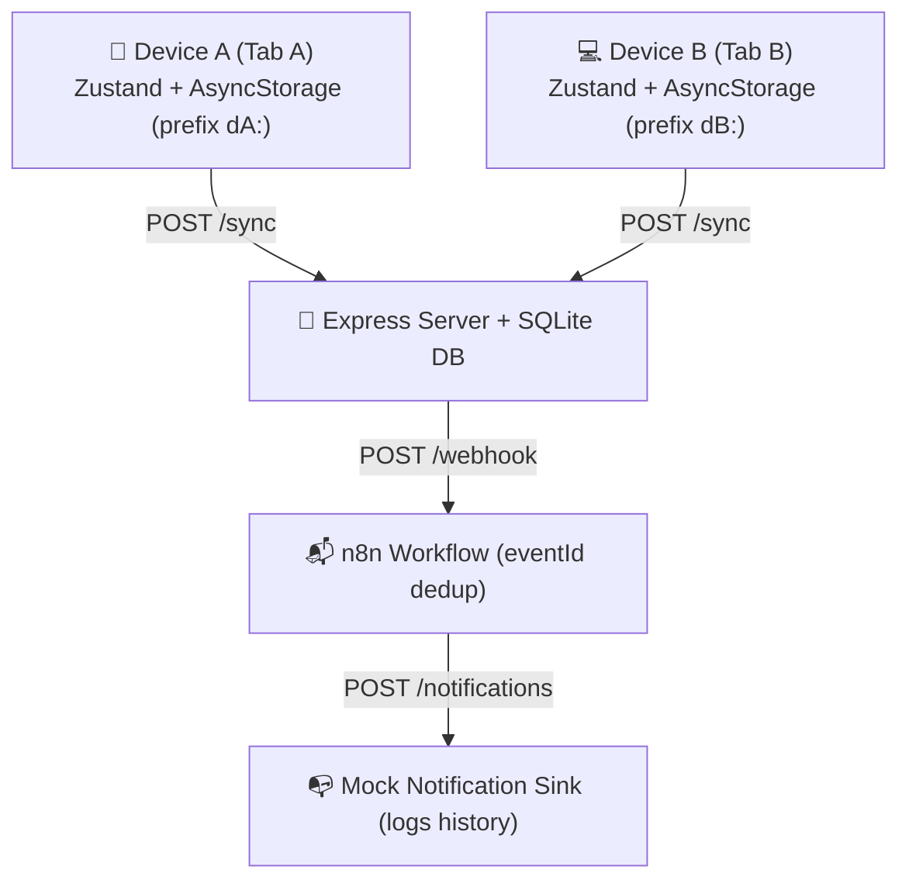

# Alcovia — Offline-First Study App (Distributed Sync Demo)

A full-stack, offline-first study app built for the Alcovia engineering intern take-home. This application demonstrates the implementation of a distributed sync protocol using an append-only operations log, Lamport logical clocks, Last-Writer-Wins (LWW) conflict resolution, deletion tombstones, and idempotent rewards and webhooks.

---

## Key System Guarantees

*   **✓ Offline Queue Durability**: Pending actions are stored locally using namespaced `AsyncStorage` (`device-a:pendingOps`, etc.), surviving app restarts and tab refreshes.
*   **✓ Idempotent Rewards**: Multi-device completed focus sessions are processed exactly once. Replays of identical operations are ignored via the server's `processed_rewards` table.
*   **✓ Idempotent Notifications**: Dual-layer deduplication (server-side `n8n_events` log + n8n static workflow data caching) guarantees that study reward notifications are sent exactly once.
*   **✓ Conflict Resolution (LWW + Tombstones)**: Concurring status changes are resolved using Lamport clocks and lexicographical device ID tie-breakers. Deletions are treated as terminal tombstones and win unconditionally.
*   **✓ Two-Device Convergence**: Disconnected devices converge to the exact same state upon reconnection, matching the server's operations log.

---

## System Architecture



---

## Data Models

### Operation (The Universal Change Unit)
All state mutations are encapsulated in an operation log:
```typescript
interface Operation {
  opId: string;          // UUID — globally unique
  deviceId: string;      // "device-a" | "device-b" | "device-c"
  studentId: string;     // hardcoded as "student-001"
  lamport: number;       // logical clock counter
  type: OperationType;   // "TASK_CREATED" | "TASK_STATUS_CHANGED" | "TASK_DELETED" | "FOCUS_SESSION_STARTED" | "FOCUS_SUCCESS" | "FOCUS_FAIL"
  entityId: string;      // taskId or sessionId
  payload: Record<string, any>; // change values (e.g. { status: "DONE" })
  createdAt: string;     // ISO timestamp (for display/sorting only)
}
```

### Task
```typescript
interface Task {
  id: string;
  studentId: string;
  subjectId: string;
  chapterId: string;
  title: string;
  status: "NOT_STARTED" | "IN_PROGRESS" | "DONE";
  deleted: boolean;      // Tombstone flag
  lamport: number;       // Lamport clock of last modifying operation
  deviceId: string;      // Device that made the last modification (tie-breaker)
}
```

### Focus Session
```typescript
interface FocusSession {
  id: string;
  studentId: string;
  deviceId: string;
  targetMinutes: number;
  startedAt: string;
  completedAt?: string;
  status: "RUNNING" | "SUCCESS" | "FAILED";
  failReason?: "give_up" | "app_switch";
  elapsedSeconds: number;
  rewarded: boolean;
}
```

### Reward State
```typescript
interface RewardState {
  studentId: string;
  coins: number;
  streak: number;
  lastFocusDate: string;
  todayFocusMinutes: number;
}
```

---

## Sync Protocol & Sequence

```mermaid
sequenceDiagram
    participant Client as Client (Device A)
    participant Server as Express Server
    participant n8n as n8n Webhook
    participant Sink as Notification Sink

    Client->>Server: POST /sync { deviceId, studentId, lastSeenLamport, operations: [...] }
    Note over Server: 1. Check opId to skip duplicates<br/>2. Apply LWW & Tombstones to SQLite tables<br/>3. Append new operations to server log
    
    rect rgb(20, 20, 40)
        Note over Server: Process Rewards (Atomic SQLite transaction)
        Server->>Server: Check if sessionId in processed_rewards
        Server->>Server: Update reward_state (coins += 50)
        Server->>Server: Insert into processed_rewards
    end

    rect rgb(20, 40, 20)
        Note over Server: Trigger n8n webhook (non-blocking)
        Server->>Server: Insert eventId into n8n_events (Idempotency)
        Server-->>n8n: POST /webhook/alcovia-reward { eventId, studentId, coins, streak, message }
        Note over n8n: Check eventId against workflow static data
        n8n-->>Sink: POST /notifications (Forward valid notification)
    end

    Server-->>Client: Return { operations: [newOps], rewardState, serverLamport }
    Note over Client: 1. Apply received operations<br/>2. Update local Lamport clock<br/>3. Clear processed pendingOps
```



---

## Conflict Resolution Rules

| Scenario | Resolution Logic | Rule Description |
|---|---|---|
| **Same task status changed concurrently** | Higher Lamport wins; lexicographical `deviceId` tie-breaker | Keeps both devices in sync even if physical timestamps differ. |
| **Task deleted on one device, modified on another** | Delete wins unconditionally | A delete operation acts as a permanent tombstone. |
| **Duplicate sync message received** | Ignored by checking `operations.opId` | Guarantees network retries are safe and idempotent. |
| **Focus session synced twice** | Ignored by checking `processed_rewards.sessionId` | Prevents students from hacking rewards by replaying sync calls. |
| **n8n webhook fired twice** | Ignored by `n8n_events` log + n8n static data check | Ensures exactly-once delivery of notifications. |

---

## File Structure

```
Alcovia/
├── client/                      # Expo Web App
│   ├── app/
│   │   ├── (tabs)/
│   │   │   ├── index.tsx        # Tasks Checklist View
│   │   │   ├── focus.tsx        # Focus Session Timer
│   │   │   ├── progress.tsx     # Progress Metrics Dashboard
│   │   │   └── dev.tsx          # Dev Control Panel & Scenarios
│   │   ├── _layout.tsx          # App boot & routing wrapper
│   │   └── device-select.tsx    # Device chooser on boot
│   ├── src/
│   │   ├── store/
│   │   │   └── useAppStore.ts   # Zustand global state & sync manager
│   │   ├── storage/
│   │   │   └── storage.ts       # AsyncStorage device namespaces
│   │   ├── sync/
│   │   │   └── lamport.ts       # Lamport clock increment/receive utils
│   │   └── types/
│   │       └── index.ts         # Shared TypeScript interfaces
│   └── package.json
│
├── server/                      # Express Backend
│   ├── src/
│   │   ├── index.ts             # App entry
│   │   ├── db.ts                # SQLite init & syllabus seeds
│   │   ├── routes/
│   │   │   ├── sync.ts          # /sync API (POST & GET state)
│   │   │   └── notify.ts        # /notifications mock sink
│   │   └── sync/
│   │       ├── conflictResolver.ts # LWW & Tombstone logic
│   │       └── rewardEngine.ts  # Idempotent rewards & n8n webhook caller
│   └── package.json
│
├── n8n-workflow.json            # Exported n8n workflow
├── README.md                    # Main Project Overview
└── DECISIONS.md                 # Design & Architecture Decisions
```

---

## Quick Start Guide

### Prerequisites
*   Node.js (v18 or higher)
*   npm

### 1. Set Up and Start Backend Server
```bash
cd server
npm install
npm run dev
# Server runs on http://localhost:3001
```

### 2. Set Up and Start Client Web App
```bash
cd client
npm install --legacy-peer-deps
npm run web
# Metro bundler builds for Web and opens http://localhost:8081
```

### 3. Open Multiple Simulated Devices
To see offline sync in action, open **two separate browser windows/tabs** referencing different device IDs:
*   **Device A**: [http://localhost:8081/?device=device-a](http://localhost:8081/?device=device-a)
*   **Device B**: [http://localhost:8081/?device=device-b](http://localhost:8081/?device=device-b)

*Note: The tabs will persist their separate local states in `localStorage` under distinct keys (`device-a:*` vs `device-b:*`), acting exactly like two physical devices.*

### 4. Set Up n8n (For Notification Demo)
```bash
npx n8n
# Open the locally hosted n8n console in your browser (usually http://localhost:5678)
```
1. Click **Workflows** -> **Import from File**.
2. Select the [n8n-workflow.json](file:///C:/Users/Sonu/Desktop/Alcovia/n8n-workflow.json) file at the root of the project.
3. Click **Active** toggle in the top-right corner to activate the webhook.

---

## Verification & Test Scenarios
Open the **Dev Panel** in both Tab A (`device-a`) and Tab B (`device-b`) to run the automated scenarios:

### Scenario 1: Task Conflict (LWW)
1. Device A toggles **OFFLINE**.
2. Device A updates "Linear equations" task to **DONE** (local status = `DONE`, local Lamport increments).
3. Concurrently, a remote update from Device B is sent directly to the server setting "Linear equations" task to **IN_PROGRESS** with a higher Lamport clock.
4. Device A toggles **ONLINE**.
5. **Sync outcome**: The client receives the server update. Because the server operation had a higher Lamport clock, Device B's status wins. The client's status converges to **IN_PROGRESS** and a conflict card is logged on the Dev Panel.

### Scenario 2: Dual Offline Focus Session
1. Device A toggles **OFFLINE**.
2. Device A completes a 25-minute focus session (use the Dev "Skip to end" helper).
3. Concurrently, Device B completes a separate focus session offline and syncs it with the server.
4. Device A toggles **ONLINE**.
5. **Sync outcome**: Both focus sessions sync successfully. The student receives **+100 coins** total (50 per session), showing both sessions applied. The notification history shows two unique events, demonstrating that concurrent sessions do not block each other.

### Scenario 3: Duplicate Sync Replay
1. The client sends a sync request to the server containing a specific operation.
2. The client re-sends (replays) the exact same operation ID to the server.
3. **Sync outcome**: The server recognizes the `opId` in the operations table, skips processing, and returns successfully without re-awarding coins or triggering webhooks, proving idempotency.

### Scenario 4: Delete vs Edit
1. Device A toggles **OFFLINE**.
2. Device A updates a task to **DONE**.
3. Concurrently, Device B deletes the task on the server.
4. Device A toggles **ONLINE**.
5. **Sync outcome**: The delete operation takes precedence. The task is marked as deleted (`deleted = true`) on both devices, showing that deletes win unconditionally over concurrent status changes.

---

## API Reference

| Method | Endpoint | Description |
|---|---|---|
| `POST` | `/sync` | Main endpoint. Receives pending local operations log, applies LWW resolver, and returns new database updates + reward state. |
| `GET` | `/sync/state/:studentId` | Returns the entire server-side tables state (tasks, sessions, rewards, operation logs, webhook logs) to render in the Dev Panel. |
| `POST` | `/notifications` | Mock notification endpoint called by n8n. Log output prints a styled SMS notification box to the server console. |
| `GET` | `/notifications/log` | Returns a list of all successful and ignored notification logs. |
| `GET` | `/subjects` | Returns the seeded course syllabus subjects and chapters. |
| `GET` | `/health` | Server health check. |
